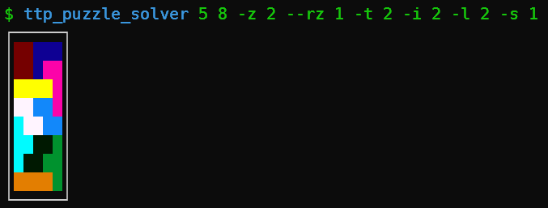

# The Talos Prinziple Puzzle Solver

This tool is a (hastily written) solver for sigil puzzles from the games ["The Talos Principle"](https://store.steampowered.com/app/257510/The_Talos_Principle/) and ["Sigils of Elohim"](https://store.steampowered.com/app/321480/Sigils_of_Elohim/).



# Build requirements
- Rust (https://rustup.rs/)

# Build & Install
- `cargo install --git https://github.com/panicbit/ttp_puzzle_solver`

# Help
```
Usage: ttp_puzzle_solver.exe [OPTIONS] <WIDTH> <HEIGHT>

Arguments:
  <WIDTH>
  <HEIGHT>

Options:
  -s, --square <SQUARE>  [default: 0]
  -i, --line <LINE>      [default: 0]
  -z, --z <Z>            [default: 0]
      --rz <REVERSE_Z>   [default: 0]
  -l, --l <L>            [default: 0]
      --rl <REVERSE_L>   [default: 0]
  -t, --t <T>            [default: 0]
  -h, --help             Print help
```